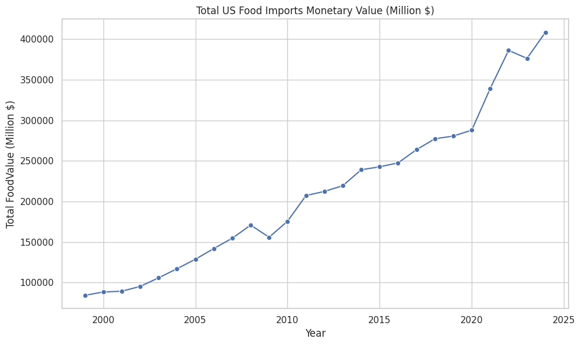
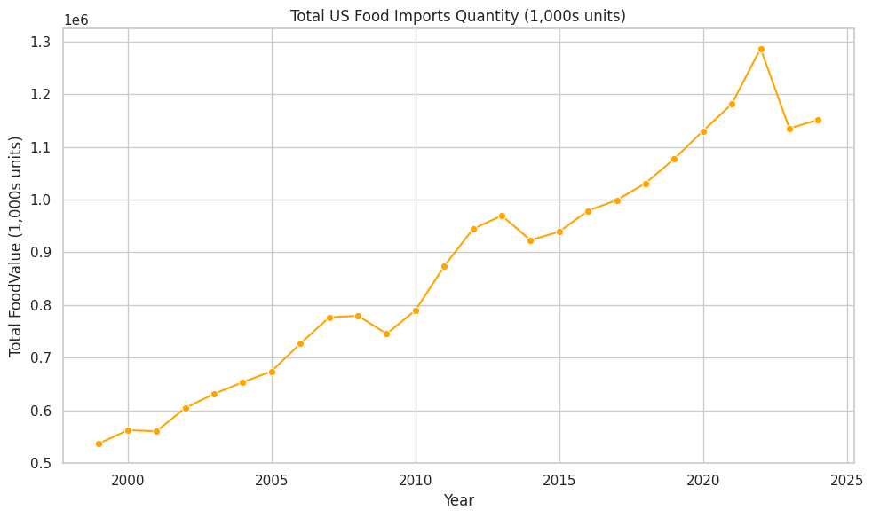
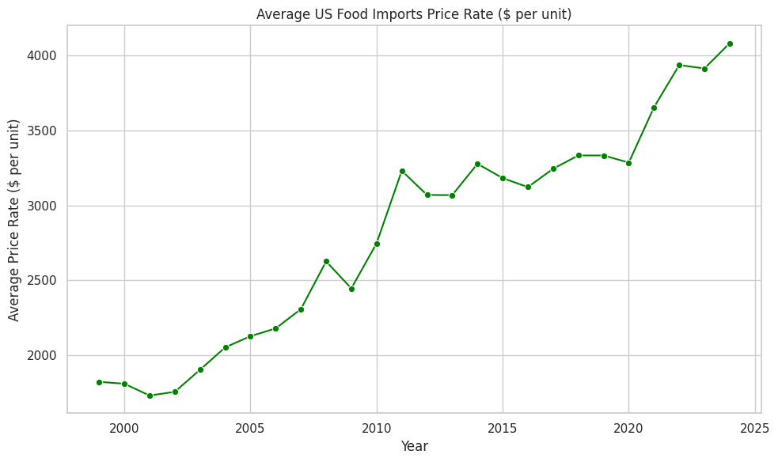
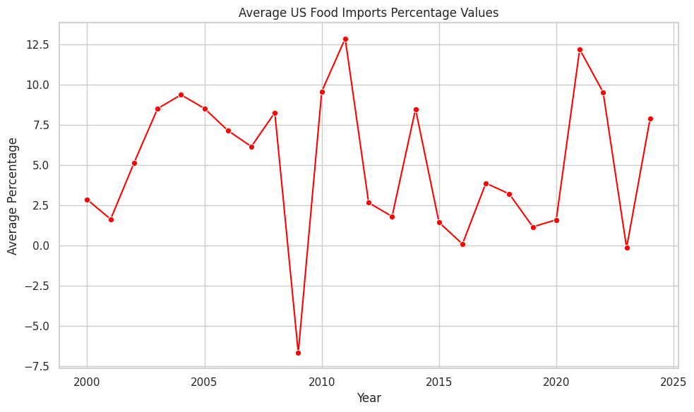
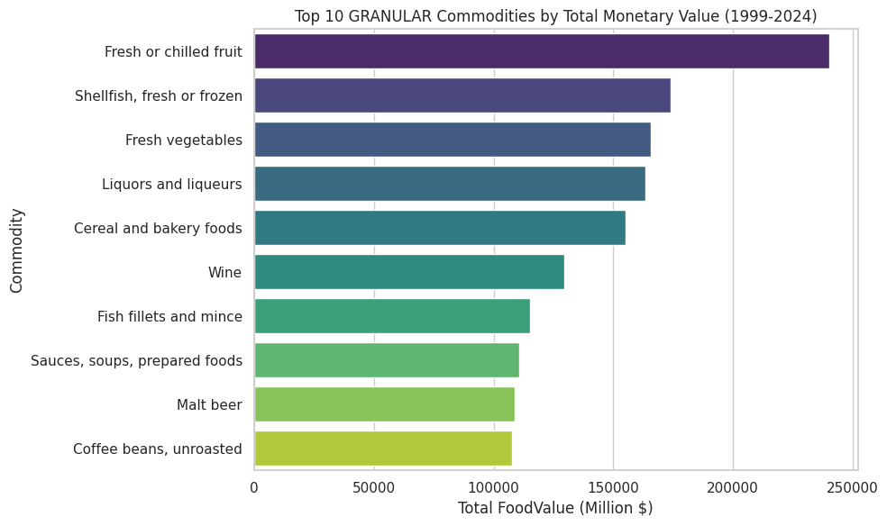
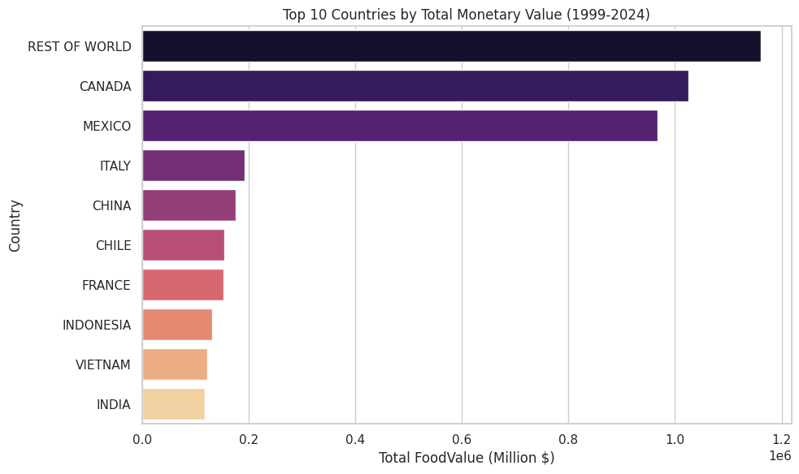
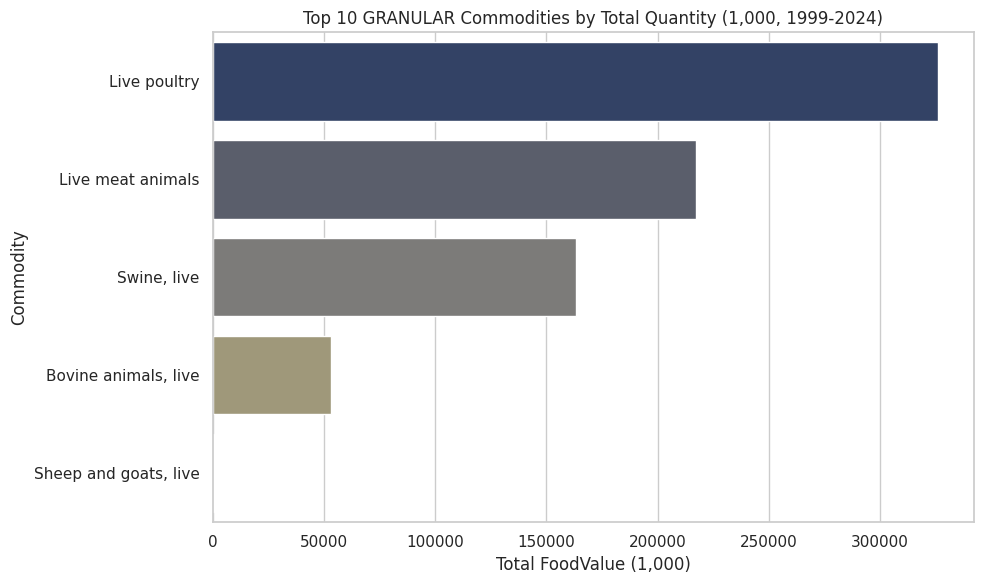
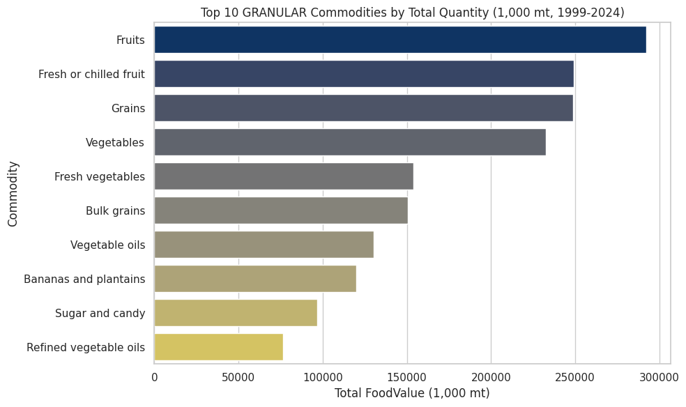
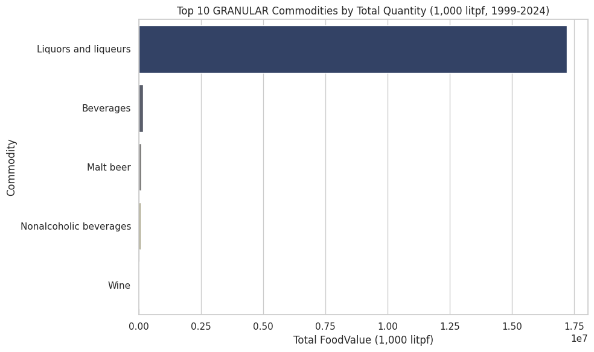

# us-food-imports

## 1. Project Overview

This project delves into the trends and patterns of United States food imports over the past two decades (1999-2024). Leveraging publicly available trade data, the analysis aims to uncover key insights regarding import value, quantity, pricing, and commodity shares, providing a comprehensive view of the U.S.'s reliance on global food supply chains.

The primary goal is to build a robust data analysis portfolio piece, demonstrating skills in data cleaning, exploratory data analysis (EDA), statistical analysis, and compelling data visualization using SQL, Python (Pandas, Matplotlib, Seaborn), and Google Colab.

## 2. Data Sourcing and Preparation

The raw data was sourced from **United States Department of Agriculture (USDA)** and initially loaded into a MySQL database. A significant portion of this project involved extensive data cleaning, transformation, and normalization using SQL. Key steps included:

* **Structured Data Extraction & Flattening:** The original raw data contained a hierarchical structure (indicated by `RowNumber` for indenting commodity levels), which was carefully analyzed and flattened to extract distinct datasets for monetary values, quantities, price rates, and percentage shares.
* **Handling of 'REST OF WORLD' Data:** Recognized and ensured the appropriate inclusion of the pre-existing 'REST OF WORLD' category within the monetary value dataset. This category, present in the original source data, represents aggregated trade from numerous smaller countries and was explicitly retained after initial filtering to provide a comprehensive view of global trade partners.
* **Specialized Global Data Separation:** The original 'WORLD' entries, which contained mixed information across different units of measure and categories (e.g., monetary, quantity, prices, percentages), were meticulously separated. This allowed us to create distinct, logically consistent tables for:
    * `food_imports_quantity` (specifically for `WORLD (Quantity)` data)
    * `food_imports_price_rate` (specifically for 'WORLD' price data)
    * `food_imports_percentage` (for various 'WORLD' and `WORLD (Quantity)` percentage metrics)
* **Data Quality Verification:** Performed checks for `NULL` values and general data inconsistencies, confirming the relative cleanliness and completeness of the dataset's core values, meaning no extensive imputation or correction was required for these aspects.
* **Data Type Conversion & Formatting:** Ensured appropriate data types and consistent formatting across all columns to prepare for Python analysis.
* **CSV Export Troubleshooting & Best Practices:** A critical issue was addressed during CSV export from MySQL Workbench, where commas within text fields (e.g., "GERMANY, FED. REPUBLIC") caused parsing errors in Python. This was resolved by strictly enforcing proper CSV export settings: `Fields terminated by:` as `,` (comma) and `Fields enclosed by:` as `"` (double quotes).
* **Export:** Exporting the cleaned and transformed data from MySQL into clean CSV files, ready for Python analysis in Google Colab.

## 3. Exploratory Data Analysis (EDA)

This section presents the initial findings and visualizations generated using Python in Google Colab. The analyses aim to identify high-level trends, key contributors, and important patterns within the U.S. food import landscape.

### 3.1. Overall Time Series Trends

Initial visualizations provide a macro-level view of how total import monetary value, quantity, and average prices have evolved from 1999 to 2024.

* **Total US Food Imports Monetary Value:** Displays the overall spending on imported food over time.
    * **Insight:** A **strong and consistent upward trend** indicates that the U.S. is increasingly spending more on imported food, likely driven by factors such as growing consumer demand, rising global food prices, and increased reliance on foreign products.
    * **Visual:**
        

* **Total US Food Imports Quantity:** Illustrates the physical volume of imported food over time.
    * **Insight:** A **clear upward trend** in quantity parallels the monetary value, suggesting that the increase in spending is not solely due to rising prices, but also to a significant expansion in the physical volume of imported food.
    * **Visual:**
        

* **Average US Food Imports Price Rate:** Shows the average price per unit of imported food over the years.
    * **Insight:** Generally, imported food is becoming **more expensive per unit over time**, with periods of volatility. Notable increases in recent years could indicate inflationary pressures.
    * **Visual:**
        

* **Average US Food Imports Percentage Values:** A high-level view of various percentage metrics (shares, inflation rates).
    * **Insight:** This chart shows significant volatility and swings into negative territory, indicating that averaging across diverse percentage types (dollar shares, volume shares, price inflation) obscures specific trends. This highlights the need for more granular analysis within this table.
    * **Visual:**
        

### 3.2. Top N Analysis: Major Contributors

Identifying the top commodities and countries provides a clear picture of the primary drivers of U.S. food imports. A key refinement was made to distinguish between granular commodities and aggregated 'Total' categories, ensuring accurate representation by filtering out aggregate entries.

* **Top 10 GRANULAR Commodities by Total Monetary Value:** Reveals the most valuable individual food items imported.
    * **Insight:** Fresh produce (e.g., `Fresh or chilled fruit`, `Fresh vegetables`) and seafood (`Shellfish, fresh or frozen`) are among the most valuable granular imports, indicating strong consumer demand for these categories. The exclusion of aggregate commodities provides a more accurate representation of individual item contributions.
    * **Visual:**
        

* **Top 10 Countries by Total Monetary Value:** Shows which countries contribute the most to the U.S.'s total food import spending.
    * **Insight:** The `REST OF WORLD` aggregate accounts for a large portion of import value, highlighting the diverse global sourcing of food. `CANADA` and `MEXICO` are consistently major trading partners due to proximity and trade agreements.
    * **Visual:**
        

* **Top 10 GRANULAR Commodities by Total Quantity (Separated by Unit of Measure):** Provides a detailed breakdown of import volumes, critically categorized by their respective units for accurate comparison. This analysis revealed a significant divergence between monetary value and quantity drivers.

    * **Total Quantity (1,000 units):**
        * **Insight:** `Live poultry` dominates this category, indicating a very high volume of live animal imports, likely for domestic processing or breeding.
        * **Visual:**
            

    * **Total Quantity (1,000 mt - metric tons):**
        * **Insight:** This category includes bulk agricultural products like `Fruits`, `Grains`, and `Vegetables`, reflecting large-scale imports of staple and raw ingredients.
        * **Visual:**
            

    * **Total Quantity (1,000 litpf - liters proof):**
        * **Insight:** `Liquors and liqueurs` overwhelmingly dominates this unit, demonstrating an immense volume of imported alcoholic beverages, which is a key driver for overall import quantity but not necessarily the highest monetary value per unit.
        * **Visual:**
            

## 4. Future Work / Next Steps

* Deep dive into percentage trends: Analyze `Food dollars` shares, `Food volume` shares, and `Import price inflation` separately to extract specific insights.
* Analyze time series trends for individual top commodities and countries.
* Explore correlations between price, quantity, and value for specific commodities.
* Consider basic predictive modeling for future import trends.

## 5. How to Run This Project

1.  **Clone the Repository:**
    ```bash
    git clone [https://github.com/vonlanot/us-food-imports.git](https://github.com/vonlanot/us-food-imports.git)
    ```
2.  **MySQL Setup:**
    * Ensure you have MySQL installed and running.
    * Follow the instructions in `us_food_imports.sql` to set up the `us_food_imports_db` database and load the raw data.
    * Execute the cleaning and transformation queries from `us_food_imports.sql` to create the four final tables.
    * **Crucially:** Export the four final tables (`us_food_imports_monetary`, `us_food_imports_quantity`, `us_food_imports_price_rate`, `us_food_imports_percentage`) as CSVs from MySQL Workbench. In the export options, ensure:
        * `File Type` is `csv`
        * `Fields terminated by:` is `,` (comma)
        * `Fields enclosed by:` is `"` (double quote)
        * `Line Separator` is `LF` (or `CRLF`, consistently)
3.  **Google Colab:**
    * Upload the exported CSV files to your Google Drive. For this project, mine was: `My Drive/Colab Notebooks/My Data/US_Food_Imports/`.
    * Open your Google Colab notebook (e.g., `US_food_imports.ipynb`) in Google Colab.
    * Run all cells sequentially. You will be prompted to mount your Google Drive to access the data.

## 6. Technologies Used

* **Database:** MySQL
* **Programming Language:** Python
* **Libraries:** Pandas, Matplotlib, Seaborn
* **Development Environment:** Google Colab, MySQL Workbench
* **Version Control:** Git, GitHub

---